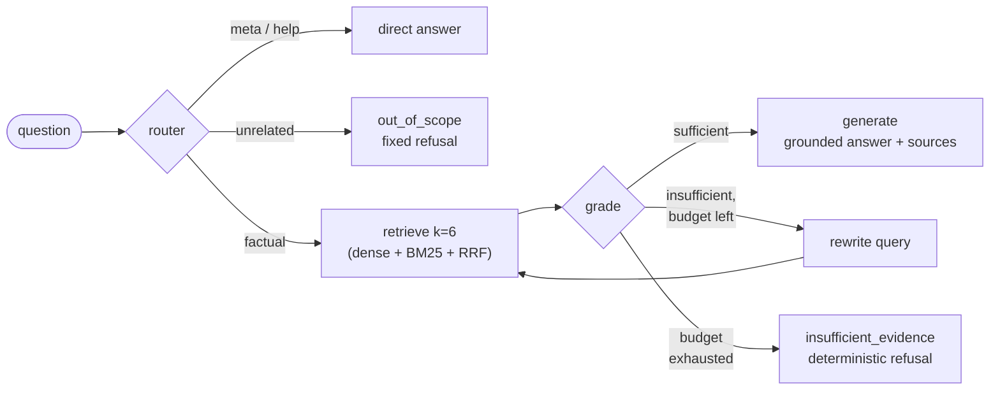

# finance-query-engine

[](https://github.com/matybq/finance-query-engine/actions/workflows/ci.yml) [](https://github.com/matybq/finance-query-engine/actions/workflows/deploy.yml)

**Live demo:** https://finance.locus.com.ar — ask the deployed agent from the web UI (try *"What is AirCover for Hosts?"*). Interactive Swagger UI at [/api/docs](https://finance.locus.com.ar/api/docs).

Dense financial filings are hard to query reliably: generic LLM answers tend to blur missing evidence, misread figures, or hallucinate when the filing is ambiguous. This project is a grounded agentic RAG system for asking natural-language questions over financial filings, with a refusal-over-hallucination stance: answers must cite source evidence, and when evidence is weak the system should say so explicitly instead of pretending certainty.

## Architecture

```text
ingestion → dual index (Chroma + BM25) → hybrid retrieval (dense + sparse + RRF) → LangGraph agent → grounded generation → guardrail
```

Canonical agent flow:



The first guardrail is structural: if retrieved evidence is still insufficient after the rewrite budget is exhausted (max 2 rewrites), the graph routes to `insufficient_evidence` instead of calling generation. Refusal is a graph edge, not a prompt instruction.

Design docs live in [`docs/`](docs/): [architecture](docs/architecture.md), [ADR log](docs/decisions.md) (28 recorded decisions), and [phase status](docs/status.md).

## Corpus

The current corpus is the **Airbnb 10-K for fiscal year 2025** (period ended **2025-12-31**), sourced from **SEC EDGAR**: https://www.sec.gov/ix?doc=/Archives/edgar/data/0001559720/000155972026000004/abnb-20251231.htm

Three sections were extracted as plain text into `data/raw/` (committed — SEC filings are public domain — so the project is reproducible end-to-end):

- Item 1 — Business
- Item 1A — Risk Factors
- Item 7 — Management's Discussion & Analysis

Why this corpus: one dense public filing with technical language, figures, and long-form structure is enough to exercise chunking and retrieval for real without multi-document complexity in the core phases. The system is corpus-agnostic, and more filings are roadmap.

## Stack

Implemented:

- LangGraph for orchestration
- FastAPI for serving
- Vite + React + TypeScript for the web UI
- Docker + docker compose for packaging
- OpenRouter for LLM access
- OpenAI `text-embedding-3-small` for embeddings
- Chroma for dense storage
- BM25 for sparse retrieval
- RRF for rank fusion
- RAGAS for report-only evaluation
- optional LangSmith tracing for LangChain/LangGraph runs
- pytest for unit tests
- ruff + mypy + GitHub Actions for CI
- uv for Python environment management

## Status

**The full cycle is complete** — from ingestion to a continuously deployed product: agentic routing + self-correcting retrieval power generation, guarded by a structural insufficient-evidence refusal. Deterministic functional evals, a report-only RAGAS suite, optional LangSmith tracing, unit tests (agent graph, retrieval fusion, API), and CI covering both the Python backend and the frontend build are in place.

The system is served through a CLI, a FastAPI app, and a React web UI, packaged with Docker and deployed on a VPS behind nginx and Cloudflare (TLS at the edge, Origin CA cert at the origin). The [live demo](https://finance.locus.com.ar) runs the same code as this repo: the API image is built from it, and the web UI redeploys automatically on every push to `main`.

## Key engineering decisions

The full rationale for every decision is in the [ADR log](docs/decisions.md); the load-bearing ones:

- **Refusal is structural, not prompted.** When the grader still marks evidence insufficient after the rewrite budget, the graph routes to a deterministic refusal node — generation is never asked to "please don't hallucinate" ([ADR-023](docs/decisions.md)).
- **Explicit StateGraph over a ReAct-style tool-calling agent.** The flow has exactly two real decision points (routing, self-correction); deterministic conditional edges make it testable and cheap to reason about ([ADR-021](docs/decisions.md)).
- **Weighted RRF fusion (dense 1.0 / sparse 0.2).** BM25's role is exact-term rescue ("Reserve Now, Pay Later", "$3 million"), not an equal vote on broad paraphrases; equal weighting let keyword noise bury the best dense chunks ([ADR-017](docs/decisions.md)).
- **Retrieval depth is asymmetric on purpose.** The plain-RAG baseline stays at `k=4` (raising it caused a measured hallucination); the agent retrieves at `k=6` because the router structurally shields it from out-of-scope questions ([ADR-018](docs/decisions.md), [ADR-024](docs/decisions.md)).
- **Evals before features.** A deterministic functional harness gated the agent work before RAGAS was added; both now run against every meaningful change ([ADR-027](docs/decisions.md)).

## Usage

```bash
uv run python -m src.ingestion.ingest
uv run finance-ask "What is AirCover for Hosts?"
```

For an interactive session with a short welcome guide:

```bash
uv run finance-ask
```

### API

```bash
uv run uvicorn src.api.app:app
```

```bash
curl -X POST localhost:8000/ask \
  -H 'content-type: application/json' \
  -d '{"question": "What is AirCover for Hosts?"}'
```

`POST /ask` returns the grounded answer, its source sections, and the agent route; `GET /health` is a liveness check. Interactive OpenAPI docs are served at `/docs`.

### Web UI

A single-page React + TypeScript app (Vite, no UI framework) in [`frontend/`](frontend/) that calls `POST /api/ask` and renders the answer with its route badge and source sections.

```bash
cd frontend
npm install
npm run dev        # proxies /api/* to a local API on :8000
npm run build      # static bundle in frontend/dist/
```

Set `API_PROXY_TARGET=https://finance.locus.com.ar` to point the dev proxy at the live demo instead of a local API.

### Docker

The image packages the API only; the prebuilt index is mounted as a volume and API keys are provided at runtime via `.env`, so neither corpus data nor secrets are baked into the image. The mount is writable because Chroma's sqlite needs write access (WAL/journal) even to serve reads.

```bash
uv run python -m src.ingestion.ingest   # once, to build data/processed/
docker compose up -d --build
```

To deploy on a VPS: clone the repo, copy `.env` and `data/processed/` to the server (`rsync -az data/processed/ user@host:finance-query-engine/data/processed/`, owned by uid 1000 so the non-root container user can write Chroma's sqlite), then run the same `docker compose up -d --build`. The live deployment adds a `docker-compose.override.yml` that binds the API to loopback only and an nginx reverse proxy exposing it under `/api/` (with `--root-path /api` so the OpenAPI docs work behind the prefix). The web UI deploys continuously: on every push to `main`, a [GitHub Actions workflow](.github/workflows/deploy.yml) builds the bundle and rsyncs it (as a dedicated `deploy` user that owns only the static root) to the VPS, where nginx serves it at `/` alongside the `/api/` proxy. The server block and the one-time VPS setup script live in [`deploy/`](deploy/).

## Evaluation

The project includes two evaluation layers.

### Functional regression checks

```bash
uv run python evals/evaluate_agent.py
```

This lightweight deterministic harness validates core behavior across router decisions, out-of-corpus refusals, factual retrieval, exact-term regressions, rewrite-loop behavior, and the structural insufficient-evidence guardrail.

Current functional eval result (2026-07-15, `gpt-4o-mini`):

| Family | Passed |
|---|---:|
| router | 3/3 |
| grounding | 2/2 |
| guardrail | 1/1 |
| factual | 2/2 |
| exact_term | 2/2 |
| rewrite_loop | 1/1 |
| **overall** | **11/11** |

### RAGAS report-only evals

A first RAGAS suite lives in `evals/ragas_cases.jsonl` and measures semantic RAG quality over a small set of gold-answer cases:

- `faithfulness` — whether the answer is supported by retrieved chunks
- `context_recall` — whether retrieved chunks contain the facts needed by the reference answer
- `factual_correctness` — whether the answer matches the reference answer

Current RAGAS result (2026-07-15, 6 cases, `gpt-4o-mini` as generator and judge):

| Metric | Mean |
|---|---:|
| faithfulness | 1.000 |
| context_recall | 1.000 |
| factual_correctness (F1) | 0.693 |

Every answer was fully grounded in retrieved evidence and retrieval surfaced the needed facts in all cases. `factual_correctness` is an F1 over atomic claims against the reference wording, so grounded-but-verbose answers score below terse exact-match phrasing — it is tracked as a diagnostic, not a pass/fail gate.

Install the optional eval dependencies and run:

```bash
uv sync --extra eval
uv run --extra eval python evals/evaluate_ragas.py
```

To control cost while iterating:

```bash
uv run --extra eval python evals/evaluate_ragas.py --limit 2
```

RAGAS results are diagnostic and report-only for now. CSV reports are written to `evals/experiments/` and are gitignored.

### Unit tests

```bash
uv run --group dev pytest
```

These tests run without API keys or corpus data: the agent graph is exercised with fake LLMs (routing, grading, rewrite budget, structural refusal), the API with a mocked agent, and retrieval fusion and generation helpers as pure functions.

### CI

GitHub Actions runs on pushes and pull requests to `main`:

- locked dependency install with eval and dev dependencies
- ruff lint + format check
- mypy type check
- RAGAS import smoke test
- pytest unit tests
- frontend type-check + build

CI intentionally does not run the LangGraph agent or RAGAS scoring, because those require API keys plus the local index; they run locally against every meaningful change and their latest results are recorded above.

### CD

A separate [Deploy workflow](.github/workflows/deploy.yml) runs on every push to `main`: it builds the web UI and rsyncs the bundle to the VPS as a dedicated `deploy` user, so the live demo tracks `main` with no manual steps.

## Observability

LangSmith tracing is optional. LangChain/LangGraph read tracing configuration from environment variables; this project also loads the same keys from `.env` and applies them before agent/generation runs.

To enable tracing:

```bash
LANGSMITH_TRACING=true
LANGSMITH_API_KEY=your_langsmith_key
LANGSMITH_PROJECT=finance-query-engine-dev
```

Optional settings:

```bash
LANGSMITH_ENDPOINT=https://api.smith.langchain.com
LANGSMITH_WORKSPACE_ID=your_workspace_id
LANGCHAIN_CALLBACKS_BACKGROUND=false
```

Agent traces are tagged with `finance-query-engine` and include corpus metadata. Tracing can capture prompts, retrieved chunks, model responses, and metadata, so only enable it for data you are comfortable sending to LangSmith. CI does not require LangSmith secrets.

## Setup

Requirements: Python >= 3.12 and `uv`.

You also need:

- `OPENROUTER_API_KEY` for LLM calls via OpenRouter
- `OPENAI_API_KEY` for embeddings via OpenAI directly (OpenRouter does not proxy the embeddings endpoint)

```bash
uv sync
cp .env.example .env
```

Then fill in the required API keys in `.env`. The raw corpus text ships with the repo; run the ingestion step once to build the local index (`data/processed/` is gitignored). See [Corpus](#corpus) for how it is sourced.
